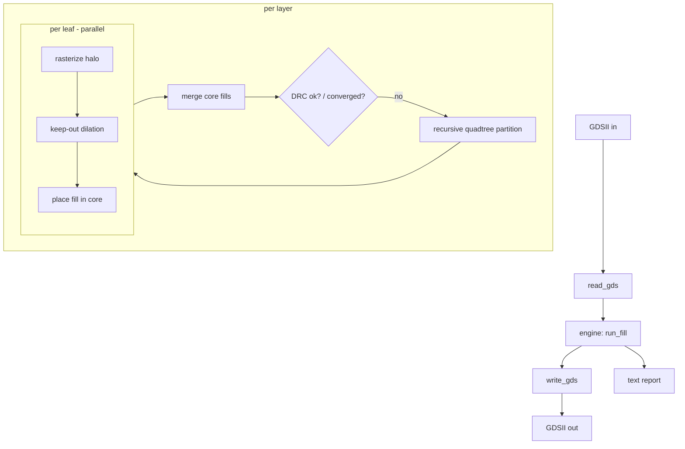
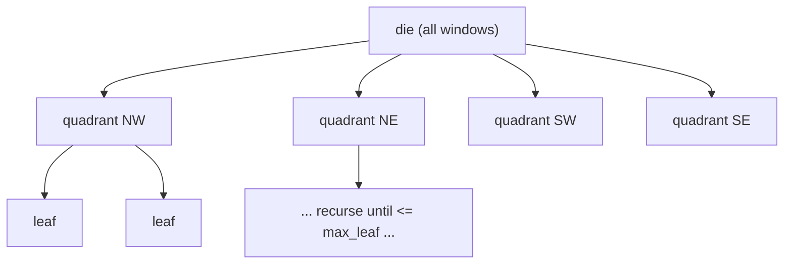
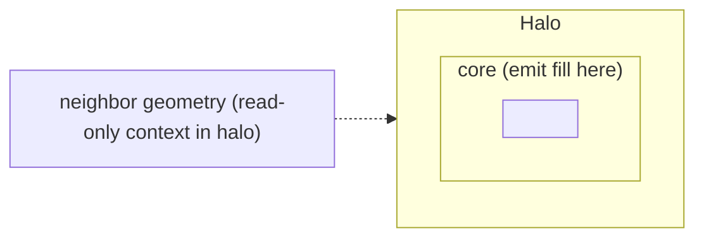

# A Recursive-Partitioned Metal Fill Engine for FEOL/BEOL Dummy Fill

**A design white paper for the `gpu_metal_fill` project**

---

## Table of contents

1. [Background: why dummy fill exists](#1-background-why-dummy-fill-exists)
2. [Problem statement and requirements](#2-problem-statement-and-requirements)
3. [System architecture](#3-system-architecture)
4. [Data model and GDSII I/O](#4-data-model-and-gdsii-io)
5. [Rasterization](#5-rasterization)
6. [Density analysis with summed-area tables](#6-density-analysis-with-summed-area-tables)
7. [Keep-out (spacing) as morphological dilation](#7-keep-out-spacing-as-morphological-dilation)
8. [Fill placement](#8-fill-placement)
9. [Recursive partitioning and merge](#9-recursive-partitioning-and-merge)
10. [Gradient-aware, DRC-driven iterative fill](#10-gradient-aware-drc-driven-iterative-fill)
11. [Design-rule checking](#11-design-rule-checking)
12. [Parallelism and the GPU-ready backend](#12-parallelism-and-the-gpu-ready-backend)
13. [The synthetic GPU-block test design](#13-the-synthetic-gpu-block-test-design)
14. [Bugs encountered and how they were fixed](#14-bugs-encountered-and-how-they-were-fixed)
15. [Results](#15-results)
16. [Limitations and future work](#16-limitations-and-future-work)
17. [File-by-file reference](#17-file-by-file-reference)

---

## 1. Background: why dummy fill exists

Modern chips are manufactured layer by layer. After each metal layer is
deposited, the wafer is planarized by **Chemical-Mechanical Polishing (CMP)**.
CMP does not remove material uniformly: regions with a **high** metal density
polish differently from **sparse** regions. Two failure modes dominate:

- **Dishing** — wide metal features get polished *below* the target height.
- **Erosion** — in dense arrays of fine features, both metal and the surrounding
  dielectric erode.

The result is **thickness variation** across the die, which changes wire
resistance/capacitance (hurting timing), can open or short layers, and lowers
yield. To keep CMP uniform, foundries impose **density rules** per layer, checked
over a sliding **window** (e.g. 20 µm × 20 µm):

- a **minimum** density (typically ~20–30 %),
- a **maximum** density (typically ~70–85 %), and
- a bounded **window-to-window gradient** (no abrupt steps).

Designs rarely satisfy the *minimum* everywhere, so tools insert non-functional
**dummy fill** (a.k.a. metal fill) — small floating shapes in the empty space —
until each window meets its target. Fill must stay a legal **spacing** away from
real geometry (a *keep-out halo*) and each fill shape must meet a **minimum
area**.

- **FEOL** (Front-End-Of-Line) = transistor layers (active/`OD`, poly/`PO`).
  Fill here is for pattern-density and mechanical-stress uniformity.
- **BEOL** (Back-End-Of-Line) = the interconnect metal stack (`M1..M14`) and
  vias. This is where most fill volume lives, and where fill runtime dominates —
  which is exactly why this project focuses on making BEOL fill **fast** via
  partitioning (and, later, GPU offload).

This project implements a self-contained, dependency-free engine that performs
this fill for both FEOL base layers and a 14-layer BEOL metal stack.

---

## 2. Problem statement and requirements

> **Input:** a GDSII layout with base layers and metal layers `M1..M14`.
> **Output:** the same layout plus dummy fill so every layer meets its CMP
> density rules, with a DRC report.

Concretely the engine must, per layer:

1. Measure existing metal **density** over a sliding window.
2. Know the **layer map** (which GDS layer/datatype is which) and the per-layer
   **fill rules**.
3. **Place fill** to satisfy min density without violating max density, gradient,
   spacing, or min-area.
4. Run **iterative DRC**: measure, fix, repeat.

An explicit non-functional requirement drove the whole architecture: **BEOL fill
is slow, so it must be parallelizable.** The chosen mechanism is **recursive
spatial partitioning** (divide the die, fill pieces independently, merge) — the
same idea commercial tools use — with a clean path to GPU offload later.

---

## 3. System architecture

The engine is a small C++17 library plus a few command-line tools. It has **no
third-party dependencies** (only the standard library; OpenMP is optional).



The compute-heavy stages (density, keep-out, fill) are hidden behind a
`FillBackend` interface (`include/metalfill/backend.hpp`) so they can run on the
CPU today (OpenMP) or a GPU tomorrow (CUDA) without touching the orchestration.

**Coordinate convention.** Everything internal is in integer **database units
(dbu)**. The GDS `UNITS` record is written as `1 dbu = 1 nm` (`meters_per_dbu =
1e-9`) with `1 user unit = 1 µm`, so `1 µm = 1000 dbu`. Rules are authored in
microns and converted to dbu at runtime.

---

## 4. Data model and GDSII I/O

### Geometry (`geometry.hpp`)

- `Point{dbu x,y}`, `BBox` with `expand()/width()/height()/valid()`.
- `Polygon{int layer, datatype; vector<Point> pts}` with `bbox()`.
- `make_rect(layer, datatype, x0,y0,x1,y1)` — the workhorse, since fill shapes
  and the synthetic designs are rectangles.

### GDSII reader/writer (`gdsii.{hpp,cpp}`)

GDSII is a record-based **big-endian** binary format. Each record is
`[2-byte length][1-byte record-type][1-byte data-type][payload]`. The reader is a
straightforward record loop that imports `BOUNDARY` (and `BOX`) elements as
polygons and ignores references/paths; the writer emits a single top cell.

Two subtleties are handled explicitly:

- **8-byte GDS reals** (used by the `UNITS` record) are *not* IEEE-754. They are
  `sign(1 bit) · mantissa/2^56 · 16^(exponent-64)`. `put_real8`/`get_real8`
  implement the conversion.
- **Closing vertex**: GDS boundaries repeat the first point as the last; the
  reader drops the duplicate, the writer re-adds it.

The in-memory `Layout` holds the library/cell name, the `UNITS`, and the polygon
list, and exposes `dbu_per_um()` and `bbox()`.

Because this is a from-scratch reader/writer, a **round-trip unit test**
(`test_gds_roundtrip`) guards it: write a layout, read it back, and check that
polygon count, layer/datatype, coordinates, and units are preserved.

---

## 5. Rasterization

Density and spacing are far cheaper to reason about on a **raster** than on
polygons, so each layer is rendered into a boolean **occupancy grid**.

### The grid (`raster.hpp`)

`Grid` is a dense `nx × ny` array of `uint8_t` (0/1) with a cell size `cell`
(dbu) and an origin `(ox, oy)`. Cell `(ix,iy)` covers
`[ox+ix·cell, ox+(ix+1)·cell) × [oy+iy·cell, oy+(iy+1)·cell)`.

`make_grid(area, cell)` allocates a grid that covers `area` using **exact ceil
sizing** (`nx = ceil(width/cell)`). (An earlier version added a `+1` guard cell;
see [§14](#14-bugs-encountered-and-how-they-were-fixed) for why it was removed.)

### Scanline polygon fill (`rasterize`)

For each polygon, for each grid **row**, the scanline is taken at the row's
vertical **center** `yc`. We collect the x-coordinates where polygon edges cross
`yc`, sort them, and fill the spans between consecutive crossing pairs
(even-odd rule). A cell is set if its **center** lies inside a span:

```
cx0 = ceil ((xl - ox)/cell - 0.5)
cx1 = floor((xr - ox)/cell - 0.5)
```

This is exact for axis-aligned rectangles (all shapes here) and robust for
arbitrary simple polygons. `test_rasterize_rect` checks a 500×500 dbu rectangle
at 100-dbu cells produces exactly 25 occupied cells.

The choice of `cell` matters and is derived per layer — see
[§8](#8-fill-placement).

---

## 6. Density analysis with summed-area tables

CMP density is evaluated over many overlapping windows, so a naïve per-window sum
would be `O(window_area)` each. Instead we build a **summed-area table (SAT)**,
a.k.a. integral image, once, and answer any window in `O(1)`.

### The SAT (`density.{hpp,cpp}`)

For occupancy `occ[x,y] ∈ {0,1}`, the SAT is

```
SAT[y+1][x+1] = occ[x,y] + SAT[y][x+1] + SAT[y+1][x] − SAT[y][x]
```

The occupied area of any half-open cell rectangle `[x0,x1) × [y0,y1)` is then

```
area = SAT[y1][x1] − SAT[y0][x1] − SAT[y1][x0] + SAT[y0][x0]
```

`build_sat` computes it with a single running-row pass (cache friendly), and
`SummedAreaTable::area()` clamps to bounds and returns the four-corner
difference.

### The density map (`compute_density`)

A `DensityMap` is produced by sliding a `win_cells` window with a `step_cells`
stride. Each `Window` records its tile index, its cell range, and its
`density = occupied_area / window_area`. `min/mean/max_density()` summarize a
layer. `test_sat_density` verifies both the SAT arithmetic and a 2×2 tiling on a
hand-checked grid.

Why the SAT matters here: it is the *same* primitive used for keep-out dilation
([§7](#7-keep-out-spacing-as-morphological-dilation)) and it maps cleanly onto a
GPU (prefix sums + constant-time box lookups), which is the intended offload.

---

## 7. Keep-out (spacing) as morphological dilation

Fill must stay `keepout` microns away from any real geometry. Equivalently, the
**forbidden region** for fill is the existing geometry **dilated** by the keep-out
radius. Rather than a per-cell neighborhood scan, this is computed in `O(1)` per
cell with the SAT: a cell `(ix,iy)` is *blocked* iff the box
`[ix−r, ix+r] × [iy−r, iy+r]` contains any occupied cell, where `r =
ceil(keepout/cell)`:

```
blocked[ix,iy] = (SAT.area(ix−r, iy−r, ix+r+1, iy+r+1) > 0)
```

This is `compute_keepout` in `fill.cpp`. `test_keepout` checks that `r=1` blocks
the 8-neighborhood of a single occupied cell, that a distance-2 cell is free,
and that `r=0` reduces to the occupancy itself.

---

## 8. Fill placement

### Deriving the grid resolution and pitch (per layer)

`compute_geom` (in `engine.cpp`) converts a layer's rules to dbu and picks a grid
`cell` equal to the **gcd** of the fill width/height, pitch, window and step.
That guarantees each of those lengths is an **integer number of cells**, so
window boundaries and the fill lattice are exact (no rounding drift). Fill shapes
are integer multiples of the cell.

### Placement objective (`place_fill`)

Fill candidates sit on a **pitch lattice** anchored at the grid origin. For each
window (tile) the algorithm:

1. reads the existing occupied cells via the SAT,
2. computes a **target** occupied-cell count and a **max** cap, and
3. walks the candidate lattice inside the tile, stamping a fill shape wherever
   its footprint is entirely free of the keep-out mask and of already-placed
   fill, stopping once the window reaches its target or the max cap.

Two invariants make this correct and parallel-safe:

- **Footprints stay inside their tile** (`cx + fw ≤ tile_end`), so each tile
  writes a disjoint region of the fill grid → the per-tile loop is parallelized
  with OpenMP with no data races.
- **Never exceed max**: placement stops before crossing `max_density · area`.

Fill-to-fill spacing is guaranteed *by construction*: the pitch is `1.25×` the
fill size, so shapes on the lattice never touch. `test_place_fill` verifies fill
reaches the target, respects the max cap, and places nothing where fully blocked.

The per-window target is not a single scalar; it comes from a **target map**
built by the DRC-driven loop in [§10](#10-gradient-aware-drc-driven-iterative-fill).

---

## 9. Recursive partitioning and merge

This is the core of the project and the reason it can scale.

### The idea

Fill in one region of the die is *almost* independent of another. So we split the
die with a **quadtree** into leaf partitions, fill each leaf independently (in
parallel now, on a GPU later), and **merge**. `partition_recursive`
(`partition.{hpp,cpp}`) recurses in integer lattice-units, splitting into four
children until a leaf is `≤ max_leaf` units per side (or a depth cap is hit).



### The catch: boundaries

A naïve cut breaks two things at partition edges:

1. **Density windows** that straddle a cut would see only half their geometry.
2. **Spacing** (fill-to-geometry and fill-to-fill) across the cut.

If you ignore this, you get exactly the failure the author hit first: fill placed
on top of geometry and windows blowing past the max-density limit
([§14](#14-bugs-encountered-and-how-they-were-fixed)).

### The fix: lattice-aligned cuts + halo, emit-in-core

Two mechanisms guarantee a partitioned fill equals a global fill:

- **Lattice-aligned cuts.** Partition boundaries are placed only on a lattice
  equal to `align = lcm(density_window, fill_pitch)` (per axis). Because a cut
  lands on both a window boundary *and* a pitch line, every density window lies
  entirely inside one leaf, and the fill lattice is continuous across leaves.
  The working area is snapped **outward** to this lattice (`snap_area`) and tiled
  exactly, so leaf-local window/pitch indexing coincides with the global one.

- **Halo (guard band) + emit-in-core.** Each leaf is grown by a `margin` (a
  multiple of `align`, at least `keepout + fill_size`) into a **halo**. The leaf
  rasterizes *all* geometry touching its halo as **read-only context**, so
  density and keep-out are exact right up to the core edge — but it only
  **emits** fill inside its **core**. Cores are disjoint and tile the die.



### Why merge is trivial

Because cores are **disjoint** and every fill shape is emitted fully inside its
core, the merge is a **plain concatenation** of each leaf's fill — no
de-duplication, no boundary stitching. Fill-to-fill spacing across a boundary is
automatic because both leaves place on the *same global pitch lattice*.

### Verification

`test_partition_equals_global` runs the engine twice on the same layout: once
finely partitioned (`max_leaf=1`) and once as a single partition
(`max_leaf=100000`), and asserts identical fill-shape counts and identical
post-fill min/mean density. `test_partition_cover` independently checks that the
leaf cores are lattice-aligned, mutually disjoint, and **exactly tile** the die
(by summed area), and that each halo contains its core.

---

## 10. Gradient-aware, DRC-driven iterative fill

Filling every window just to the minimum leaves steep steps next to naturally
dense regions (e.g. an SRAM macro), violating the **gradient** rule. A robust
fill must raise sparse windows *toward* their dense neighbors. This is done with
a per-window **target map** updated by DRC feedback (in `run_fill`):

1. Initialize every window's target to `min_density + fill_headroom`.
2. **Fill** with the current target map (partitioned, parallel).
3. **Measure** the achieved density map.
4. **Update targets** for each window:
   - if below `min`, keep at least the base target;
   - for each neighbor `nb`, if `density(nb) − density(here) > max_gradient`,
     raise this window's target to `density(nb) − max_gradient + grad_headroom`;
   - clamp to `max_density`.
5. If any target increased, **refill**; else stop.

Targets increase **monotonically** and are bounded by `max_density`, so the loop
converges (default cap `max_iterations = 3`, enough in practice).

The small `grad_headroom` (default 0.02) exists because placement stops *just
below* a target, leaving the achieved density one fill-quantum short; without the
overshoot, a window can sit a hair under the gradient limit (e.g. measured
`0.1501 > 0.15`). Adding the headroom makes the achieved density clear the limit.

This directly implements the "iterative DRC" step: **fill → check → raise targets
where DRC fails → refill**. Where a violation is *physically unfixable* (a very
dense macro edge with no room to fill the neighbor high enough), the loop
converges with a residual that DRC honestly reports.

---

## 11. Design-rule checking

`run_drc` (`drc.{hpp,cpp}`) checks the merged result over the **whole die** —
independently of how it was partitioned, which doubles as a cross-check on the
merge. It reports five `ViolationType`s:

| Check | How |
|-------|-----|
| `MinDensity` | window density `< min` |
| `MaxDensity` | window density `> max` |
| `Gradient` | `|density − neighbor|` (right/down) `> max_gradient` |
| `Spacing` | any fill cell that lies inside the keep-out halo |
| `MinArea` | fill-shape area `< min_area` (shape-level static check) |

The spacing check recomputes the keep-out from the *existing* geometry and
intersects it with the fill footprints; it must be zero by construction, so it is
a strong safety net. `format_report` renders a per-layer table (partitions,
existing/fill counts, iterations, before→after density, DRC count, time) plus a
detailed violation list.

---

## 12. Parallelism and the GPU-ready backend

The four compute kernels — `build_sat`, `compute_density`, `compute_keepout`,
`place_fill` — are declared on the `FillBackend` interface. `CpuBackend`
(`backend_cpu.cpp`) implements them by delegating to the reference kernels, which
are **OpenMP-parallel** where the work is independent:

- `place_fill` parallelizes over tiles (disjoint writes), and
- the engine parallelizes over **partitions** (`#pragma omp parallel for` in
  `partitioned_fill`), which is the primary source of speedup.

Every kernel was chosen because it maps naturally onto a GPU:

- `build_sat` → parallel prefix sums,
- `compute_density`/`compute_keepout` → constant-time box lookups / a box filter,
- `place_fill` → per-window independent stamping.

A CUDA backend can therefore be added as a second `FillBackend` implementation
and selected via `EngineConfig::prefer_gpu` with **no change** to the engine.
That work is deliberately deferred; `make_cuda_backend()` currently returns
`nullptr`.

---

## 13. The synthetic GPU-block test design

Testing needs realistic input. `make_gpu_block` (`tools/make_gpu_block.cpp`)
generates a structurally realistic — but not real — GPU block:

- an `N×N` grid of **SM (streaming-multiprocessor) tiles**, each containing two
  **SRAM macros** (register file + shared memory, dense bitcell-like stripes on
  `OD/PO/M1..M3`) and a **standard-cell logic** region (cell rows on `OD/PO`,
  local routing on `M1..M3`, density varying per tile via a deterministic PRNG);
- **routing channels** between tiles carrying bus routing on `M4..M8`;
- **global clock/spine** routes on `M9/M10`;
- a regular, sparse **power grid** (wide straps) on `M11..M14`.

The effect is that every layer has a *different* density profile — dense on the
lower layers, nearly empty on the upper layers except for power straps — so fill
does meaningful, layer-specific work everywhere. A simpler generator
(`make_dummy_gds`) produces a controlled per-window density pattern used by the
tests.

---

## 14. Bugs encountered and how they were fixed

The project was built and validated incrementally; the important defects and
their fixes are worth recording.

### 14.1 Lattice-alignment break at partition boundaries (critical)

**Symptom:** after adding partitioning, the demo produced many `MaxDensity`
(windows at 0.98 vs a 0.80 limit) and `Spacing` violations — fill was landing on
top of geometry.

**Root cause:** each leaf's core was clamped to the *raw geometry bounding box*,
whose edges are **not** on the window/pitch lattice. That offset the leaf-local
density windows from the global windows by a sub-window amount, so `place_fill`'s
per-window accounting used one set of windows while DRC used another. In a leaf
where a window appeared nearly empty (because it was misaligned), fill was piled
in on top of real geometry.

**Fix:** snap the working area **outward to the `align = lcm(window, pitch)`
lattice** (`snap_area`) and tile it exactly; anchor partitions and both the
per-leaf and global grids at the same lattice origin. After this, leaf-local
windows coincide with global windows and the caps apply to the right windows.
Verified by `test_partition_equals_global`.

### 14.2 Rule inconsistency: pitch too coarse to reach min density

**Symptom:** `M14` (and other upper metals) could not reach the 0.30 min density.

**Root cause:** the initial rules used `pitch = 2 × fill`, which caps fill
coverage at `(fill/pitch)² = 25 %` — physically below the 30 % minimum.

**Fix:** set `pitch = 1.25 × fill` (and a divisor of the window), giving ~64 %
achievable coverage with headroom, while keeping the lattice coherent.

### 14.3 Gradient handling

**Symptom:** ~200 `Gradient` violations because filling only to `min` left steep
steps next to dense windows.

**Fix:** the per-window, DRC-driven target loop of
[§10](#10-gradient-aware-drc-driven-iterative-fill), plus a small `grad_headroom`
to beat placement discretization (`0.1501 > 0.15` boundary cases).

### 14.4 `make_grid` over-allocation

An early `make_grid` added a `+1` guard cell, which created a thin extra window at
the far edge and could produce spurious edge-window density readings. Because the
area is now snapped outward to the lattice, exact `ceil` sizing covers everything
and the tiling divides evenly.

### 14.5 Macro-edge gradient in the GPU block

**Symptom:** the first GPU block left a few residual `Gradient` violations at
SRAM macro edges — a very dense macro window next to logic that fill physically
cannot raise enough to smooth.

**Resolution:** this is a *real* limitation of any fill flow, not a tool bug. For
a clean demonstration the synthetic macro densities (test-data parameters only)
were tapered slightly so the steps are fillable. On real designs such residuals
are expected and are honestly reported by DRC.

---

## 15. Results

All 77 unit/end-to-end checks pass (`make test`), in both the OpenMP and serial
(`OPENMP=0`) builds.

**Simple synthetic design** (`make demo`, 100 × 97 µm, 16 layers):
400 existing polygons → **186,236 fill shapes, 0 DRC violations**. OpenMP across
partitions runs in ~0.87 s vs ~1.99 s serial (~**2.3×**).

**GPU block** (`make gpu-demo`, 180 × 180 µm, 9 SM tiles):
15,885 existing polygons → **~1.39 M fill shapes, 0 DRC violations**, 52
partitions per layer, ~4 s. Every layer is brought in-band: metals reach the 0.30
min (after-min ≥ 0.32) without exceeding max or violating gradient/spacing.

The `render_layer` tool visualizes any layer (existing = navy, fill = orange,
partition cores = red); the power-grid layers (`M11..M14`) make the keep-out
halos around the wide straps clearly visible.

---

## 16. Limitations and future work

- **GPU offload** — the whole point of the backend abstraction. A CUDA
  implementation of the four kernels is the natural next step.
- **Via fill** between metal layers is not implemented.
- **Multi-patterning coloring** (LELE/SADP mask assignment) for advanced nodes.
- **Grounded/tied fill** (vs floating) and coupling-capacitance-aware fill for
  timing-critical nets.
- **Non-rectilinear fill / staggered patterns** and technology-specific fill
  cells; the current fill is a rectangular lattice.
- **Hierarchy** — the reader flattens to a single cell; real flows fill
  hierarchically and reuse fill across instances.
- **Real PDK rules** — the layer map and rules in `layermap.cpp` are illustrative
  placeholders, not a real technology.
- **Fill distribution** — placement fills a window greedily; a more uniform
  spatial distribution within a window can further reduce local gradients.

---

## 17. File-by-file reference

| File | Responsibility |
|------|----------------|
| `include/metalfill/geometry.hpp` | points, bbox, polygons, `make_rect` (all in dbu) |
| `gdsii.{hpp,cpp}` | GDSII reader/writer, 8-byte real codec |
| `raster.{hpp,cpp}` | occupancy grid, scanline rasterization, `stamp_rect` |
| `density.{hpp,cpp}` | summed-area table, windowed density map |
| `fill.{hpp,cpp}` | keep-out dilation, per-window fill placement |
| `partition.{hpp,cpp}` | recursive quadtree partitioner, `gcd`/`lcm` |
| `drc.{hpp,cpp}` | density / gradient / spacing / min-area checks |
| `rules.hpp`, `layermap.{hpp,cpp}` | fill-rule struct + default layer map |
| `backend.hpp`, `backend_cpu.cpp` | compute backend interface + CPU/OpenMP impl |
| `engine.{hpp,cpp}` | orchestration: geom, snap, partition, iterate, merge, report |
| `tools/make_dummy_gds.cpp` | controlled synthetic layout for tests |
| `tools/make_gpu_block.cpp` | realistic synthetic GPU block |
| `tools/run_fill.cpp` | CLI: GDS in → filled GDS + report |
| `tools/render_layer.cpp` | render a layer (existing/fill/partitions) to PPM |
| `tests/test_main.cpp` | 77 unit + end-to-end checks |

### Key tunables (`EngineConfig`, `FillRule`)

- `max_iterations`, `max_leaf` (partition leaf size), `fill_headroom`,
  `grad_headroom`, `prefer_gpu`.
- Per layer: `window_um`, `step_um`, `min/max_density`, `max_gradient`,
  `fill_w/h_um`, `fill_pitch_x/y_um`, `keepout_um`, `min_area_um2`, `is_beol`.

---

*This engine is a compact, verifiable reference implementation of the density →
partition → fill → iterative-DRC flow. Its structure — lattice-aligned recursive
partitioning with halo context and an emit-in-core merge, behind a GPU-ready
backend — is exactly what is needed to scale BEOL fill to large dies and, later,
to a GPU.*
